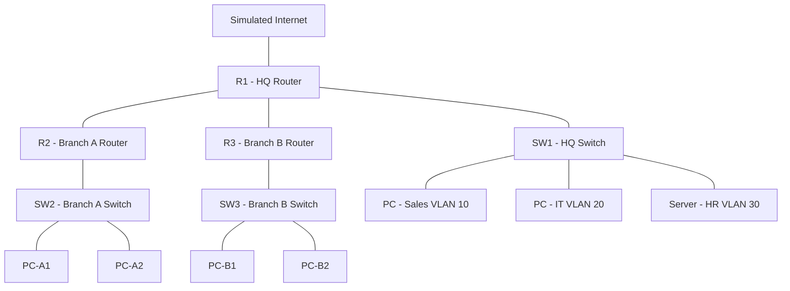

Enterprise Network Simulation — HQ + Branch Offices
Overview

This project simulates a small company's network infrastructure using Cisco Packet Tracer: a headquarters site with three departments (Sales, IT, HR) and two branch offices connected over WAN links. It demonstrates VLAN segmentation, inter-VLAN routing, dynamic routing with OSPF, NAT for internet access, DHCP for automatic addressing, and an ACL enforcing department-level access control.

Goal: Build a realistic multi-site enterprise topology from scratch and secure it, to demonstrate practical CCNA-level networking skills beyond theory.

## Topology

At HQ:
   R1 --- SW1 (VLANs 10/20/30) --- PC-HQ1 (Sales), PC-HQ2 (IT), Server-HQ (HR)

(See /screenshots/topology.png for the full Packet Tracer diagram.)

Devices used
3x Router 2911 (R1 – HQ, R2 – Branch A, R3 – Branch B)
3x Switch 2960 (SW1, SW2, SW3)
5x PCs, 1x Server (HQ HR/file server)
IP addressing plan
Site	VLAN/Segment	Subnet	Gateway
HQ	VLAN 10 – Sales	10.10.10.0/24	10.10.10.1
HQ	VLAN 20 – IT	10.10.20.0/24	10.10.20.1
HQ	VLAN 30 – HR	10.10.30.0/24	10.10.30.1
Branch A	LAN	10.20.1.0/24	10.20.1.1
Branch B	LAN	10.30.1.0/24	10.30.1.1
WAN	R1–R2 link	172.16.12.0/30	—
WAN	R1–R3 link	172.16.13.0/30	—
Simulated internet	R1 outside interface	203.0.113.1/30	—
What was built
VLAN segmentation at HQ separating Sales, IT, and HR traffic on SW1
Router-on-a-stick inter-VLAN routing on R1 using sub-interfaces with 802.1Q trunking
OSPF (Area 0) running across HQ and both branches for dynamic, scalable routing instead of static routes
DHCP pools on each branch router so client PCs pull addressing automatically
NAT/PAT overload at the HQ edge so internal hosts can reach the simulated internet through one public IP
Access control list restricting Branch A and Branch B from reaching the HQ HR VLAN, while still allowing HQ IT to reach it — tested and verified in both directions
Design decisions
OSPF over static routing: chosen so the network scales cleanly if more branches are added later, and so it can automatically reroute if a link fails, which static routes can't do without manual changes.
Router-on-a-stick over an L3 switch: kept the HQ router as the inter-VLAN routing point to mirror a common small-business design where a single edge router also handles NAT and WAN links, rather than introducing an extra L3 device.
ACL placed on the HR sub-interface, direction in: filters traffic as it enters the HR VLAN rather than at every branch router, keeping the security policy centralized in one place instead of duplicated across sites.
Verification performed
show ip ospf neighbor — confirmed full adjacency between R1, R2, and R3
show ip route — confirmed all sites had routes to every other subnet via OSPF
show ip nat translations — confirmed internal hosts were being translated correctly when reaching the simulated internet
Simple PDU tests — confirmed HQ IT could reach the HR VLAN, and confirmed Branch A/B pings to the HR VLAN were dropped by the ACL

(See /screenshots/ for captures of each verification step.)

What I learned
How to design and document an IP addressing scheme before configuring devices, instead of assigning addresses ad hoc
How OSPF adjacency and route propagation actually behave across multiple sites, not just in theory
How to translate a security requirement ("HR data should be isolated") into a concrete, testable ACL policy
The importance of verifying every change with a show command or a test ping rather than assuming a config is correct
Tools used

Cisco Packet Tracer, draw.io (diagram cleanup)

Repo contents
/configs        -> running-config exports for R1, R2, R3, SW1, SW2, SW3
/screenshots    -> OSPF neighbor table, routing table, NAT translations, ACL test results, topology diagram
enterprise-network-sim.pkt  -> the Packet Tracer file itself
